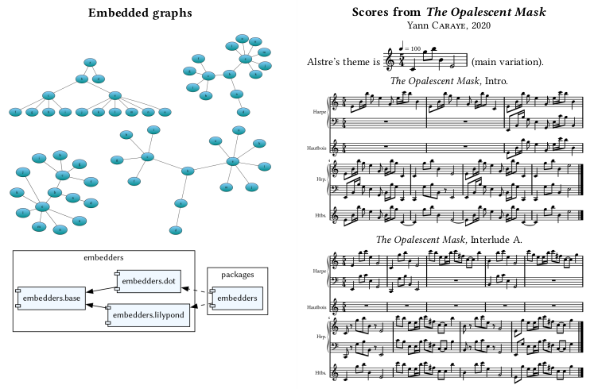

# embedders.sile

[](LICENSE)
[](https://github.com/Omikhleia/embedders.sile/actions?workflow=Luacheck)
[](https://luarocks.org/modules/Omikhleia/embedders.sile)

This module for the [SILE](https://github.com/sile-typesetter/sile) typesetting
system provides "embedders" for text formats that can be converted to an image, e.g. the DOT
graph language (Graphviz) or the LilyPond musical notation.



## Installation

This module collection requires SILE v0.14 or upper.

Installation relies on the **luarocks** package manager.

To install the latest development version, you may use the provided “rockspec”:

```
luarocks --lua-version 5.4 install --server=https://luarocks.org/dev embedders.sile
```

(Adapt to your version of Lua, if need be, and refer to the SILE manual for more
detailed 3rd-party package installation information.)

## Usage

Examples are provided in the [examples](./examples) folder.

The in-code package documentation may also be useful.
A readable version of the documentation is included in the User Manual for
the [resilient.sile](https://github.com/Omikhleia/resilient.sile) collection
of classes and packages.

## License

All SILE-related code and samples in this repository are released under the MIT License, (c) 2023 Omikhleia.
